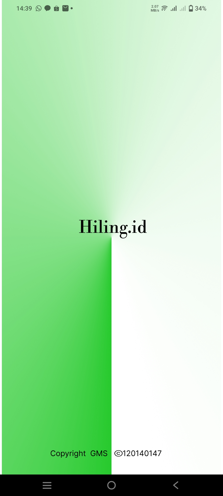
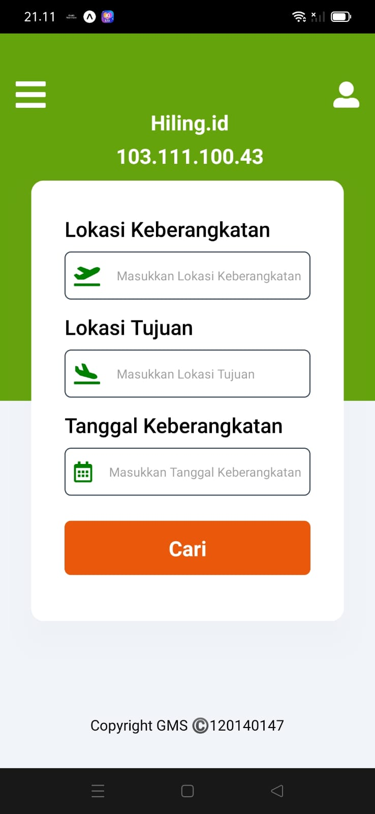
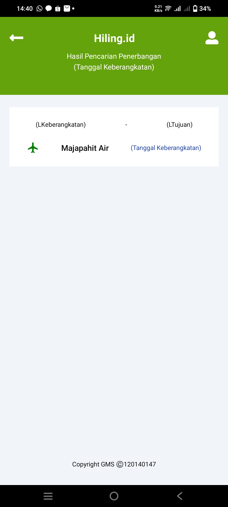
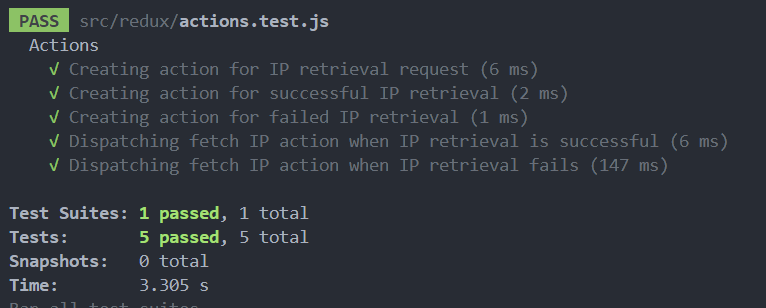

# Hiling.id

&nbsp;
this version using redux thunk for request API from <a href="https://ifconfig.me/all.json">ifconfig.me</a> see result in home preview <br/>
Apk Preview

---

<p align="center">
    
</p>

<p align="center">
    
</p>

<p align="center">
    
</p>

&nbsp;
Hasil Unit Test Jest

---

<p align="center">
    
</p>

## Unit Test using Jest

go the root folder in this repo and run syntax bellow and you can see result of test unit using jest

```
npm test
```

## Installation

Run the following command below in project terminal root to build android apk

```
yarn install
```

or

```
npm install
```

&nbsp;
Next is run the same function as git init inside expo

```
npx expo install expo-updates
```

&nbsp;
Build inside expo

```
expo build:android
```

or

```
npm install -g eas-cli
eas build -p android
```

&nbsp;
Then wait and follow the instruction if it the first build, generate a new key and choose apk.Last if expo need login in terminal input same as your expo.dev account
&nbsp;

## Dependencies

- ["expo-status-bar": "~1.4.0"](https://docs.expo.dev/versions/latest/sdk/status-bar/),
- ["react-native-safe-area-context": "4.3.1"](https://docs.expo.dev/versions/latest/sdk/safe-area-context/),
- ["react-native-screens": "~3.15.0"](https://docs.expo.dev/versions/latest/sdk/screens/),
- ["nativewind": "^2.0.11"](https://www.nativewind.dev/quick-starts/expo)
- ["@expo/vector-icons": "13.0.0"](https://icons.expo.fyi/)
- ["redux-thunk@2.4.2"](https://www.npmjs.com/package/redux-thunk)
- ["jest@29.5.0"](https://jestjs.io/docs/configuration)
- ["redux-mock-store@1.5.4"](https://www.npmjs.com/package/redux-mock-store)
- ["axios@1.3.5"](https://axios-http.com/docs/intro)
- ["axios-mock-adapter@1.21.4"](https://www.npmjs.com/package/axios-mock-adapter)
